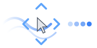
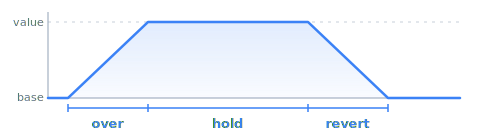
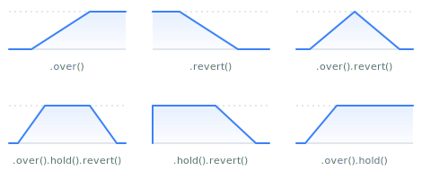
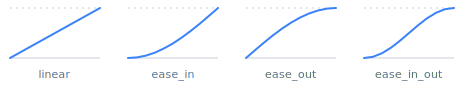
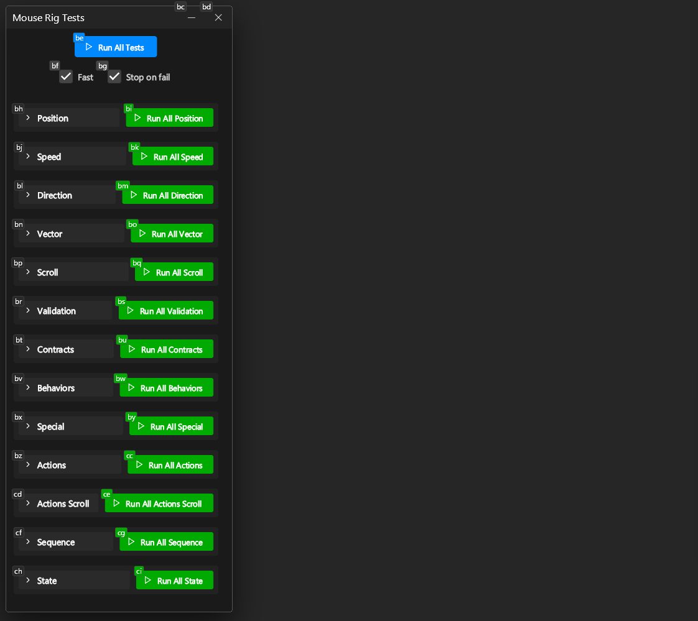

# Talon Mouse Rig

<table width="600"><tr>
<td width="150"></td>
<td>All purpose mouse rig for Talon with movement and scrolling. Prefers OS-specific relative movement to be compatible with games.</td>
</tr></table>

## Talon Actions

**Movement**

* `user.mouse_rig_move` - Move a fixed distance in a direction
* `user.mouse_rig_move_natural` - Move a fixed distance with smooth easing
* `user.mouse_rig_move_value` - Move a fixed distance in the current direction
* `user.mouse_rig_go` - Start continuous movement
* `user.mouse_rig_go_natural` - Start continuous movement with smooth turns and speed ramp
* `user.mouse_rig_pos_to` - Move to an absolute screen position
* `user.mouse_rig_pos_to_natural` - Move to an absolute screen position with smooth easing

**Speed and Direction**

* `user.mouse_rig_speed_to` - Set speed to an absolute value
* `user.mouse_rig_speed_add` - Add to the current speed
* `user.mouse_rig_speed_mul` - Multiply the current speed
* `user.mouse_rig_direction` - Set direction to a cardinal direction
* `user.mouse_rig_rotate` - Rotate direction by degrees
* `user.mouse_rig_reverse` - Reverse the current direction
* `user.mouse_rig_boost` - Speed offset that ramps up and decays
* `user.mouse_rig_boost_start` - Start a sustained speed offset
* `user.mouse_rig_boost_stop` - Stop a sustained speed offset

**Scroll**

* `user.mouse_rig_scroll` - Scroll a fixed number of ticks
* `user.mouse_rig_scroll_natural` - Scroll with smooth easing via native API
* `user.mouse_rig_scroll_go` - Start continuous scrolling
* `user.mouse_rig_scroll_go_natural` - Start continuous scrolling with smooth transitions
* `user.mouse_rig_scroll_speed_to` - Set scroll speed
* `user.mouse_rig_scroll_speed_add` - Add to scroll speed
* `user.mouse_rig_scroll_speed_mul` - Multiply scroll speed
* `user.mouse_rig_scroll_direction` - Set scroll direction
* `user.mouse_rig_scroll_direction_by` - Rotate scroll direction by degrees
* `user.mouse_rig_scroll_boost` - Scroll speed offset that ramps up and decays
* `user.mouse_rig_scroll_boost_start` - Start a sustained scroll speed offset
* `user.mouse_rig_scroll_boost_stop` - Stop a sustained scroll speed offset

**Control**

* `user.mouse_rig_stop` - Stop movement, optionally with smooth deceleration
* `user.mouse_rig_scroll_stop` - Stop scrolling, optionally with smooth deceleration
* `user.mouse_rig_button_prime` - Hold a mouse button during the next rig action, release on stop
* `user.mouse_rig_sequence` - Chain actions with waits between steps
* `user.mouse_rig_reset` - Reset rig to default state

**State**

* `user.mouse_rig_state` - Get the full state object for reading computed values
* `user.mouse_rig_state_speed` - Get the current speed
* `user.mouse_rig_state_direction` - Get the current direction as (x, y)
* `user.mouse_rig_state_direction_cardinal` - Get the current direction as a string
* `user.mouse_rig_state_is_moving` - Check if the mouse is currently moving

See [mouse_rig.py](mouse_rig.py) for full signatures and parameters.

## Installation

Clone this repo into your [Talon](https://talonvoice.com/) user directory:

```sh
# mac and linux
cd ~/.talon/user

# windows
cd ~/AppData/Roaming/talon/user

# This repo
git clone https://github.com/rokubop/talon-mouse-rig
```

Go to **[mouse_rig_user.talon](mouse_rig_user.talon)** to start trying out commands. This is your file to customize.

## Examples

### Sequences

Chain actions that wait for each animation to finish before continuing:

```python
actions.user.mouse_rig_sequence([
    lambda: ctrl.mouse_click(0, down=True),
    lambda: actions.user.mouse_rig_pos_to(500, 300, 500),
    lambda: ctrl.mouse_click(0, up=True),
])
```

Use `user.mouse_rig_wait` to insert pauses:

```python
actions.user.mouse_rig_sequence([
    lambda: actions.user.mouse_rig_go("right", 3),
    lambda: actions.user.mouse_rig_wait(1000),
    lambda: actions.user.mouse_rig_stop(),
])
```

### Button Prime

Prime a mouse button to hold during the next rig action and release on stop. Useful for drag operations in `.talon` files:

```talon
# Pan with middle-click drag
rig pan left:
    user.mouse_rig_button_prime("middle")
    user.mouse_rig_move_natural("left", 200)

# Continuous pan - button releases when you say "rig stop"
rig pan go left:
    user.mouse_rig_button_prime("middle")
    user.mouse_rig_go("left", 4.0)
```

### Reading State

Simple checks via Talon actions:

```python
if actions.user.mouse_rig_state_is_moving():
    actions.user.mouse_rig_speed_mul(2)

cardinal = actions.user.mouse_rig_state_direction_cardinal()  # "left", "up_right", etc.
```

The state object gives full access to computed values, base values, and layer introspection:

```python
state = actions.user.mouse_rig_state()

# Computed values (base + all active layers)
state.speed            # 6.5
state.direction        # Vec2(x=0.7, y=-0.7)
state.vector           # speed * direction
state.pos              # current screen position

# Base values (without layer effects)
state.base.speed       # 4.0

# Layer introspection
state.layers           # dict of active layer states
if "sprint" in state.layers:
    print(state.layers["sprint"].speed)  # layer's speed contribution
```

### Timing

Many actions accept **over/hold/revert** parameters to control transitions:

```python
# Set speed to 10 over 500ms, hold for 1s, then revert over 500ms
actions.user.mouse_rig_speed_to(10, over_ms=500, hold_ms=1000, revert_ms=500)

# Boost: speed offset that ramps up over 800ms, then decays over 800ms
actions.user.mouse_rig_boost(8, over_ms=800, release_ms=800)

# Sustained boost: ramp up, hold until explicitly stopped
actions.user.mouse_rig_boost_start(8, over_ms=800)
actions.user.mouse_rig_boost_stop(release_ms=800)
```

## Transitions and Easings

All operations can transition through three phases: **over** → **hold** → **revert**, with callbacks at each stage.



Mix and match any combination:



Transitions also accept an easing function. Solid = base, faded = 2→4 (sharper).



When Talon actions support transitions, you'll see parameters like `over_ms`, `hold_ms`, `revert_ms`, and `easing`.

Not all actions expose every parameter. For full control, use the [fluent API](#fluent-api).

## Fluent API

`rig = actions.user.mouse_rig()` - full control over every operation.

```python
rig.pos.to(960, 540).over(400, "ease_in_out")
rig.speed(8)
rig.direction.to(1, 0)
rig.direction.by(90).over(500)              # rotate
rig.scroll.by(0, 3)                        # scroll down 3 ticks
rig.scroll.by_pixels.by(0, 5).over(400)    # smooth scroll via native API
rig.scroll.speed.to(5)
rig.scroll.direction.to(0, 1)              # scroll down
rig.stop()
rig.stop(1000)                             # smooth stop
```

### Callbacks

Chain `.then()` at each phase:

```python
rig.speed.add(10).over(300) \
    .then(lambda: print("ramped up")) \
    .hold(2000) \
    .then(lambda: print("held")) \
    .revert(300) \
    .then(lambda: print("reverted"))
```

### Offset and Override

Use an offset layer for a separate, revertible effect.
Available on all properties pos, speed, direction, etc

```python
# start (can do up to 3 stacks)
rig.speed.offset.stack(3).add(10).over(200)

# later
rig.speed.offset.revert(200)
```

Built in layers are `offset` or `override`.

### Layers

Instead of using built-in `offset`, use named layers when you want to invoke a start and stop at different times, and be able to reference it in `state.layers` for introspection.

```python
rig.layer("boost").speed.add(10).over(1000)
rig.layer("boost").revert(1000)  # remove effect
rig.layer("boost").bake()        # flatten into base
rig.layer("boost").emit(1000)    # convert to anonymous layer that fades out
```

### Behaviors

Behaviors control what happens when an action fires again while already active. They work on any property - base, offset, or named layers:

* **stack** - Add another instance on top (default). Optionally cap with `stack(max)`.
* **queue** - Wait for the current instance to finish, then run.
* **throttle** - Ignore repeated fires within a time window.
* **replace** - Cancel the current instance and restart from scratch.
* **debounce** - Delay execution until fires stop for a given window.

```python
# On base properties
rig.speed.queue.to(10).over(500)               # queue speed changes
rig.direction.queue.by(90).over(500)           # queue rotations
rig.speed.throttle(200).add(1)                 # rate-limit speed bumps

# On offset layers
rig.speed.offset.stack(3).add(10).over(200)    # max 3 boost stacks

# On named layers
rig.layer("boost").queue.speed.add(10)         # queue until finished
rig.layer("boost").throttle(500).speed.add(10) # rate-limit
rig.layer("boost").replace.speed.add(10)       # restart from scratch
```

### Quick Reference

**Properties:** `pos`, `speed`, `direction`, `scroll.speed`, `scroll.direction`, `scroll.vector`

**Operators:** `.to()`, `.add()` / `.by()`, `.sub()`, `.mul()`, `.div()` - additive and multiplicative cannot be mixed on the same layer

**Lifecycle:** `.over(ms, easing?)`, `.over(rate=X)`, `.hold(ms)`, `.revert(ms?, easing?)`, `.then(callback)`

**Behaviors:** `.stack(max?)`, `.queue()`, `.throttle(ms?)`, `.replace()`, `.debounce(ms)`

**Easing:** `linear`, `ease_in`, `ease_out`, `ease_in_out`, `ease_in2` … `ease_in_out4`

**Shortcuts:** `rig.stop(ms?)`, `rig.reverse(ms?)`, `rig.bake()`

**State:**

```python
rig.state.pos          # computed (base + all effects)
rig.state.base.speed   # base only
rig.state.layers["sprint"]  # LayerState or None
```

### Execution Note

Fluent chains execute on garbage collection. If you hold a reference to the builder, it may not run until the variable goes out of scope. Call `.run()` to execute immediately:

```python
builder = rig.speed.add(10).over(300)
builder.run()  # execute now instead of waiting for GC
```

## Platform APIs

Mouse and scroll use OS-specific APIs for compatibility with games and applications that don't respond to Talon's default mouse movement.

**Mouse** (`user.mouse_rig_api` setting):
* `"talon"` - Talon's built-in mouse API (default for absolute movement)
* `"platform"` - Native OS API: SendInput (Windows), CGEvent (macOS), XTest (Linux). Default for relative movement.

**Scroll** (`user.mouse_rig_scroll_api` setting):
* `"default"` - Follows `user.mouse_rig_api` (default)
* `"platform"` - Native OS API with sub-line precision, enabling smooth direction transitions at low scroll speeds

Individual actions can also override the API with the `api` parameter.

## Tests

200+ tests across 13 groups run live inside Talon and serve as working examples. See the [test files](tests/) for usage patterns.

Uncomment [mouse_rig_dev.talon](mouse_rig_dev.talon) to enable.

Requires [talon-ui-elements](https://github.com/rokubop/talon-ui-elements) (v0.14.0+).


